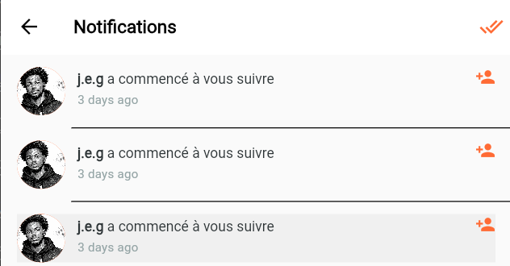

# Walkthrough : Améliorations de la page Notifications

Les modifications suivantes ont été apportées pour améliorer l'expérience utilisateur des notifications.

## Changements apportés

### Interface utilisateur (UI)
- **Suppression des lignes de séparation** : La liste des notifications est désormais plus épurée, sans traits horizontaux entre les éléments.
- **Affichage des commentaires** : Pour les notifications de type "commentaire", le contenu du message est affiché dans un bloc stylisé sous l'action.

### Navigation et interactivité
- **Accès aux profils** : Cliquer sur une notification de "suivi" redirige désormais directement vers le profil public de l'utilisateur.
- **Accès aux posts** : Cliquer sur un "like" ou un "commentaire" ouvre les détails du post concerné.
- **Support du chargement par ID** : L'écran de détails d'un lieu (`PlaceDetailsScreen`) a été amélioré pour supporter le chargement automatique des données à partir d'un simple ID de post.

## Démonstration visuelle

## Détails techniques
- [notification_repository.dart](../lib/features/social/data/repositories/notification_repository.dart) : Ajout de la logique de récupération du contenu des commentaires via Supabase.
- [notifications_screen.dart](../lib/features/social/presentation/screens/notifications_screen.dart) : Refonte de la `ListView` et ajout des interactions de navigation.
- [place_details_screen.dart](../lib/features/places/presentation/screens/place_details_screen.dart) : Ajout du support de `postId` pour permettre la navigation depuis les notifications.

> [!NOTE]
> Des erreurs de compilation détectées lors du lancement ont été corrigées (syntaxe Supabase, accès aux objets nuls et constantes de couleurs invalides).
